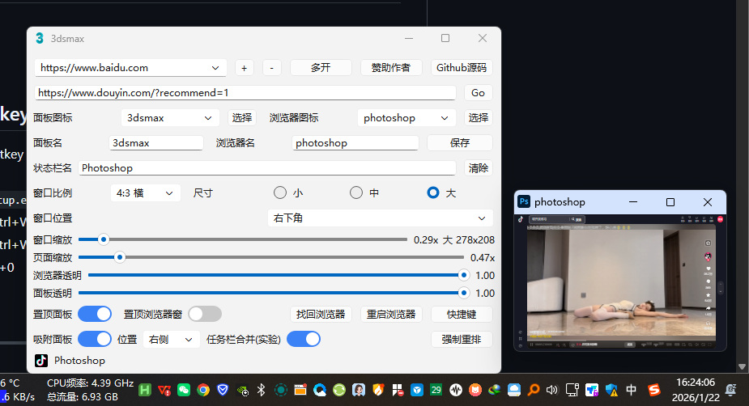
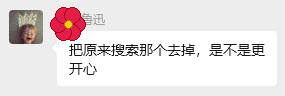
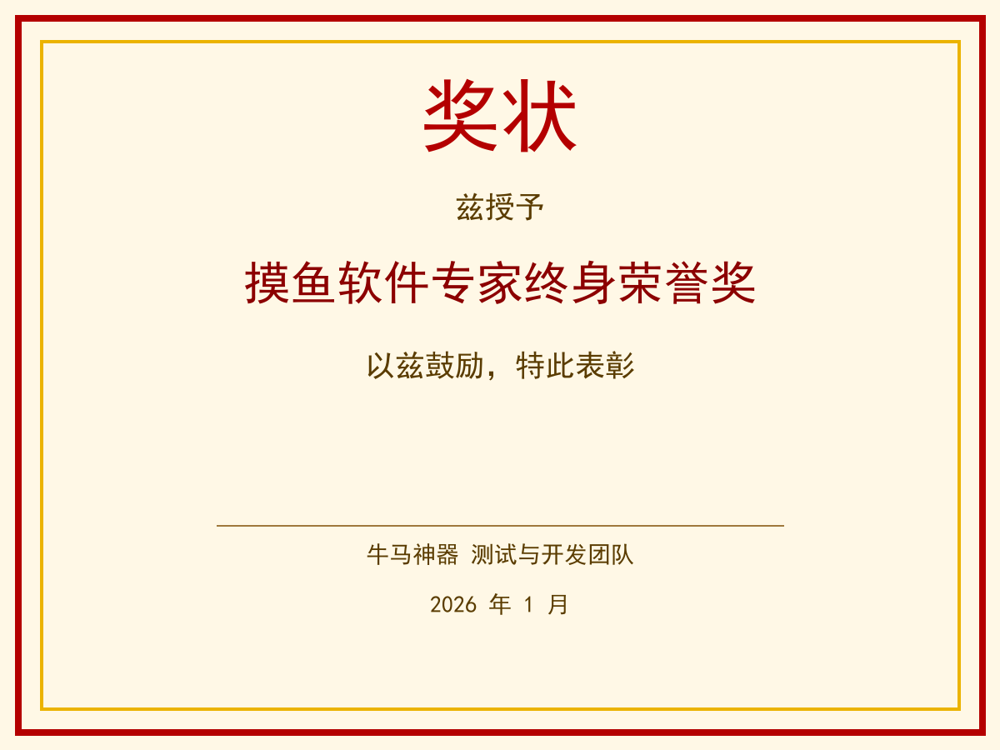

# 🚀✨ 牛马神器 4.0.12 | 摸鱼浏览器控制面板

一键启动浏览器、灵活调尺寸、缩放/透明/图标/标题随心控，专为“高效摸鱼”打造的桌面小面板～🐟🎛️

---

<div align="center">
  
</div>

## 🌟 亮点功能
- 🪟 面板+浏览器联动：一键启动/重启/找回浏览器窗口
- 📐 多种窗口比例 + 缩放级别，位置随心摆放
- 🔍 页面缩放、浏览器/面板透明度调节
- 🎨 图标&标题联动：选图标自动改名（也可手动改）
- 🧩 多开模式：一键多开浏览器窗口
- 🧷 吸附与层级重排（C 方案）：面板随浏览器一起走
- 📌 任务栏驻留：面板/浏览器图标可常驻任务栏区域

---

## 📝 更新内容
- 缺少配置时弹窗选择部署位置（当前目录/新目录），可自动迁移
- 缺少配置且有新版本时强制更新，支持安装到新目录
- 更新源可在“关于”内切换（国内优先）
- 新增轻量安装器脚本（可选择安装位置并下载最新包）

---

## ⚡ 快速开始（Python 版）
1. 安装 Python 3.8+（建议 64 位）
2. 双击 `INSTALL_DEPS.bat` 安装依赖
3. 双击 `RUN.bat` 启动

## 🌐 国内下载/镜像（可选）
- GitHub 访问慢时可用 Gitee 镜像同步（需注册 Gitee 账号）。
- 镜像地址：https://gitee.com/chen-bin98/Auto-ALL_for-Ai
- 方式一：在 Gitee 新建仓库时选择“从 GitHub 导入”，填入 GitHub 仓库地址并授权同步。
- 方式二：本地配置 Gitee 远端并推送（适合自行维护镜像）。
- 终端克隆（GitHub）：`git clone https://github.com/JerryC0820/Auto-ALL_for-Ai.git`
- 终端克隆（Gitee）：`git clone https://gitee.com/chen-bin98/Auto-ALL_for-Ai.git`
- 进入目录：`cd Auto-ALL_for-Ai`

## 💻 单命令安装/启动（终端）
```
py -3 -m pip install -r requirements.txt && py 牛马神器_v4.0.12.py
```
（在仓库目录内执行）

## ⌨️ 置顶/快捷键依赖（AutoHotkey）
- “置顶浏览器窗”和“快捷键”功能依赖 AutoHotkey（v1/v2 都可）
- `RUN.bat` 会自动检测并用 `winget` 安装
- 无网络时可手动运行 `AutoHotkey_2.0.19_setup.exe`（已放在本目录，作为 Plan B）
- 面板最小化快捷键（可在“快捷键”里改）：Ctrl+Win+Alt+0
- 面板恢复快捷键（可在“快捷键”里改）：Ctrl+Win+Alt+.
- 关闭全部（面板+浏览器）：Ctrl+Shift+Win+0
- 置顶快捷键：Ctrl+Win+Alt+T
- 取消置顶快捷键：Ctrl+Shift+Win+T

---

## 📦 EXE 版（已打包）
- 标准版（需 `_internal`）：`dist\牛马神器_v4.0.12\牛马神器_v4.0.12.exe`
- 单文件版（无需 `_internal`）：`dist\牛马神器_v4.0.12_onefile.exe`
- 直接双击运行即可

> ✅ EXE 图标已使用 `assets/牛马爱摸鱼V2.01.ico`

---

## 🧰 目录结构（常用）
- `牛马神器_v4.0.12.py`：主脚本
- `牛马神器_安装器_v4.0.12.py`：轻量安装器脚本
- `assets\`：赞助二维码等资源
- `_mini_fish_icons\`：内置图标素材
- `_mini_fish_settings.json`：配置文件（自动生成）

---

## 🛠️ 打包说明（需要自行重新打包时）
在仓库目录执行：
```
py -m PyInstaller --noconfirm --clean --name "牛马神器_v4.0.12" --icon "assets\牛马爱摸鱼V2.01.ico" --add-data "assets;assets" --windowed "牛马神器_v4.0.12.py"
```
输出目录：`dist\牛马神器_v4.0.12\`

---

## ❓ 常见问题
- 浏览器启动失败：请检查是否安装 Chrome/Edge
- 首次运行慢：可能在自动下载驱动，请耐心等待

---

## ❤️ 赞助作者
本脚本免费使用，如果对你有帮助，欢迎随意支持作者，谢谢！

<div align="center">
  
  
</div>

## 🧃 穷鬼入口
识相点哈，别给我宝宝一杯蜜雪冰城都点不了！

<div align="center">
  
  
</div>

---

## 📜 License
MIT

---

## 🙏 感谢参与测试人员
感谢图牛6群成员的大力支持与测试：

- 需求提出者：幻想终将破灭（促进本软件问世）
- 专业测试员/Debug 专家：南非鲁迅

每人一朵小红花（已加在头像旁）：  
  


### 🏅 荣誉奖状

